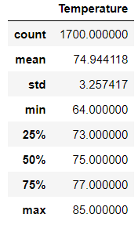
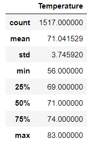
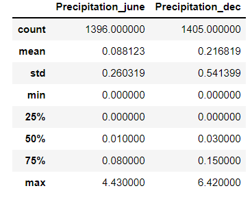

# Surfs_Up 

## Overivew
We are interested in creating a Surf Shop in Owahu and are approached by a potential investor. They are interested in weather data, in particular the temperature and precipitation data for the months of June and December. Using sqlite queries, a descriptive statistical table was created to help summarize the results.  

## Resources  
- Data Sources: 
  - hawaii.sqlite   
- Software: Python 3.7.10, Anaconda 4.10.1

## Results
### June Temperature Summary Data Frame

- The average temperature in the month of June was 75° F

### December Temperature Summary Data Frame

- The average temperature in the month of December was 71° F
- The range for the minimum temperature observed in the two months is 8° F
 

## Summary

Analysis of the data provided shows that Owahu is a potential locale for investing in a Surf Shop. The minimum temperatures never dipped below 71° F (in December), while the maximum temperature observed in June was 85° F. These temperature readings are nicely complimented by the precipitation readings, where the most it ever rained was 6.42 inches in December and 4.43 inches in June. Below is a summary table that show precipitation data:

